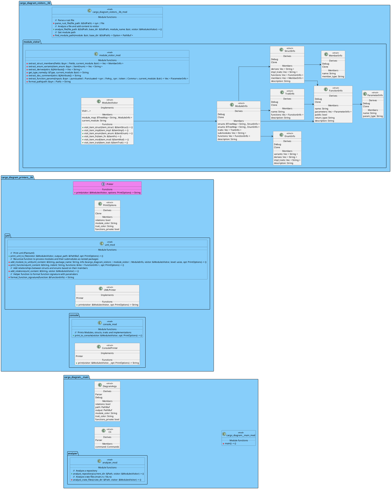

# cargo-diagram

Create diagrams (PlantUML) about your rust code! 

> ⚠️ **Warning:** Work in Progress! A lot features are missing! 

Run `cargo diagram` and you will get a diagram about your full repository! 

## Feature list

| Feature | Description | State |
| -------- | ------- | -------- |
| Module Overview | Generate a uml diagram that shows your modules, structs, traits and functions. | Alpha |
| Struct Overview | Generate a standard uml diagram about your structs | WIP |
| C4 | Generate a c4 component diagram | WIP |
| Flow | Generate flow charts of specific functions | WIP |

## Install

Install with cargo:

```
cargo install cargo-diagram
```

## Print options

```
❯ cargo diagram --help
Creates diagrams about your crate

Usage: cargo-diagram diagram [OPTIONS]

Options:
  -r, --relations                    Show relations inside of the diagram (alpha)
  -p, --path <PATH>                  Select a different path to search [default: ./]
  -o, --output <OUTPUT>              Select a different path to search [default: ./overview.puml]
  -m, --module-color <MODULE_COLOR>  [default: #lightskyblue]
  -t, --trait-color <TRAIT_COLOR>    [default: #violet]
  -f, --functions-private            Draw private functions
  -h, --help                         Print help
  -V, --version                      Print version
```

## Module Overview

## Default


## Detailed

With 
- private functions
- relations of structs


