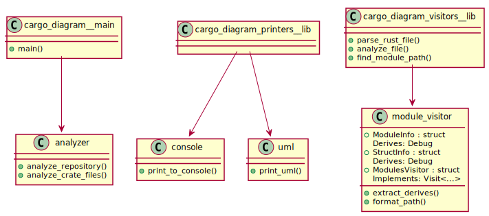

# cargo-diagram

Create diagrams (PlantUML) about your rust code! 

> ⚠️ **Warning:** Work in Progress! A lot features are missing! 

Run `cargo diagram` and you will get a diagram about your full repository! 

## Feature list

| Feature | Description | State |
| -------- | ------- | -------- |
| Module Overview | Generate a uml diagram that shows your modules, structs, traits and functions. | Alpha |
| Struct Overview | Generate a standard uml diagram about your structs | WIP |
| C4 | Generate a c4 component diagram | WIP |
| Flow | Generate flow charts of specific functions | WIP |

## Install

Install with cargo:

```
cargo install cargo-diagram
```

## Module Overview


